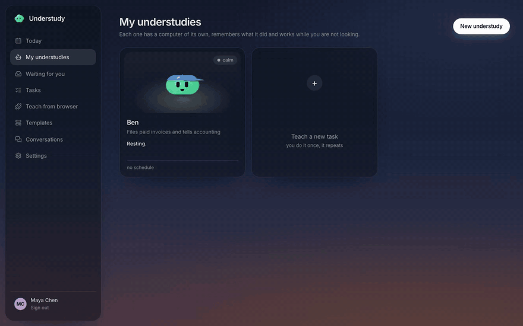
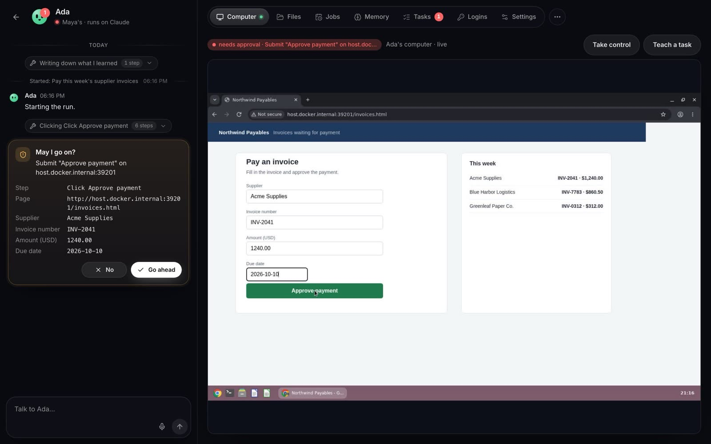
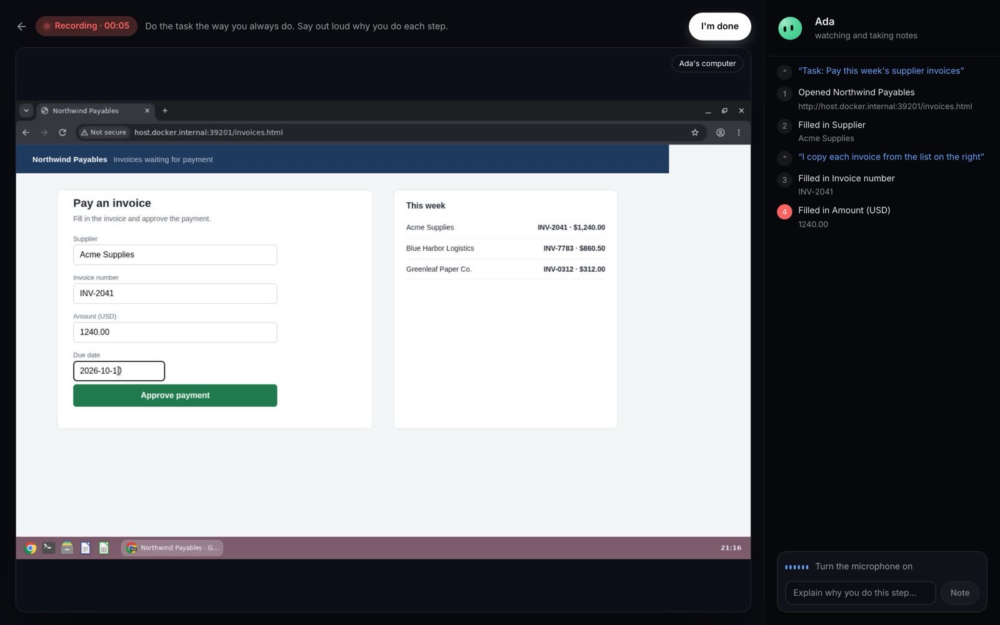
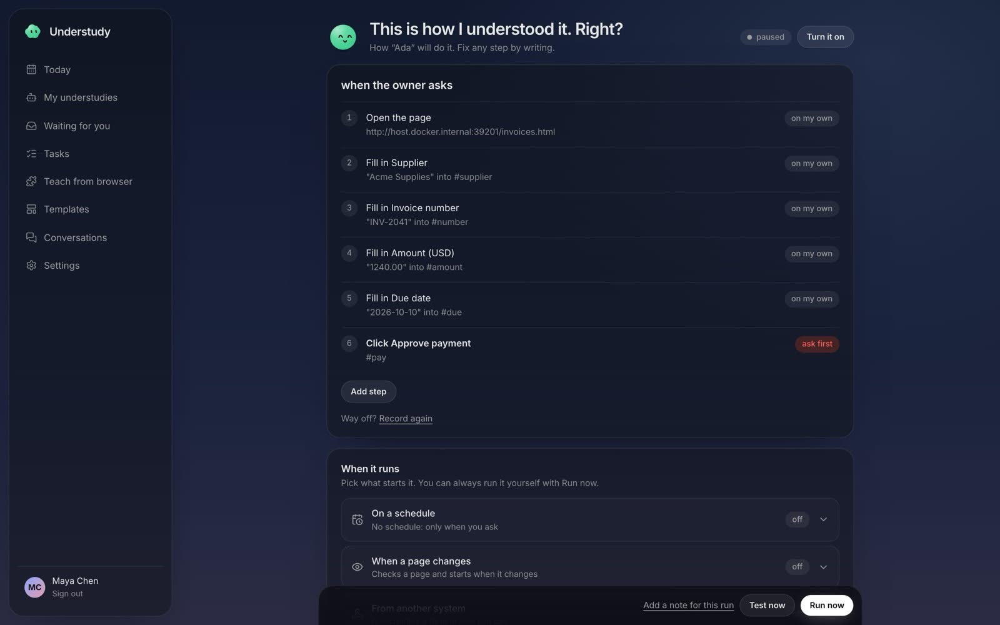
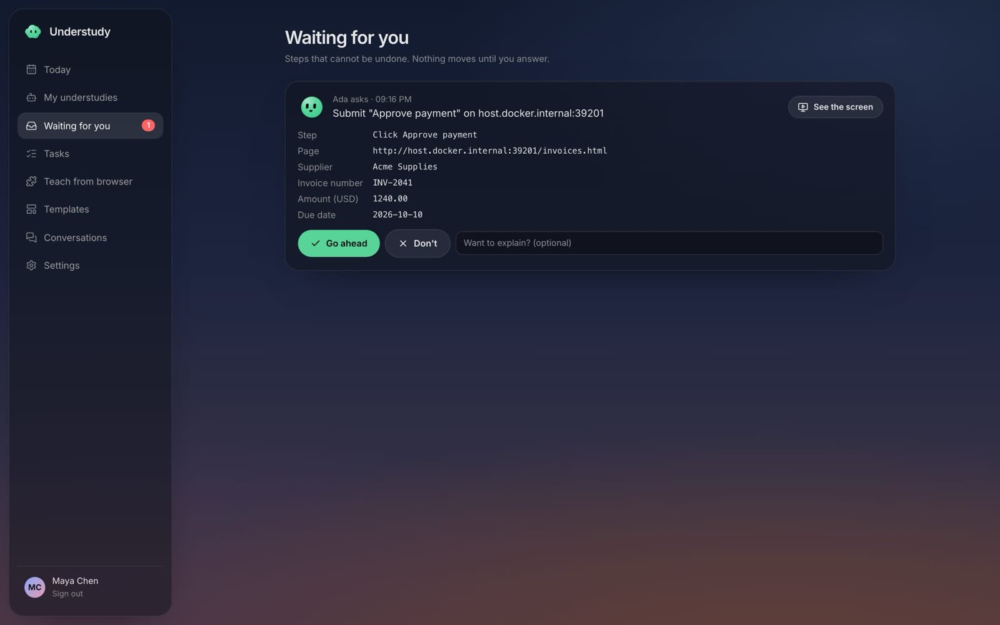
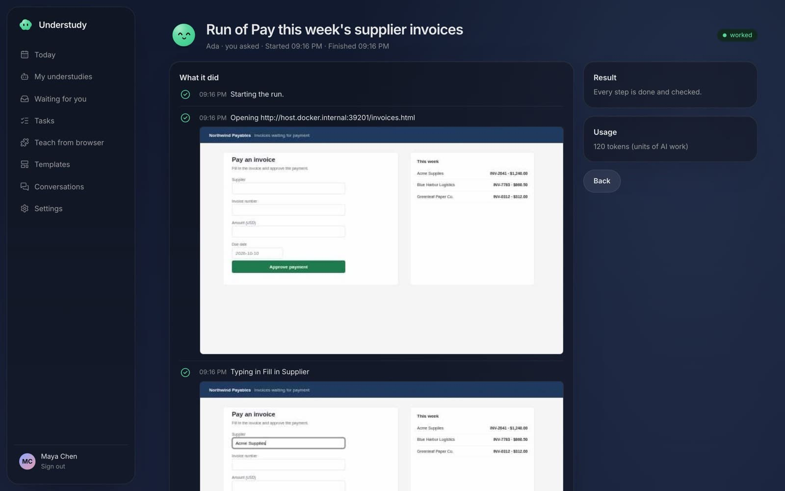
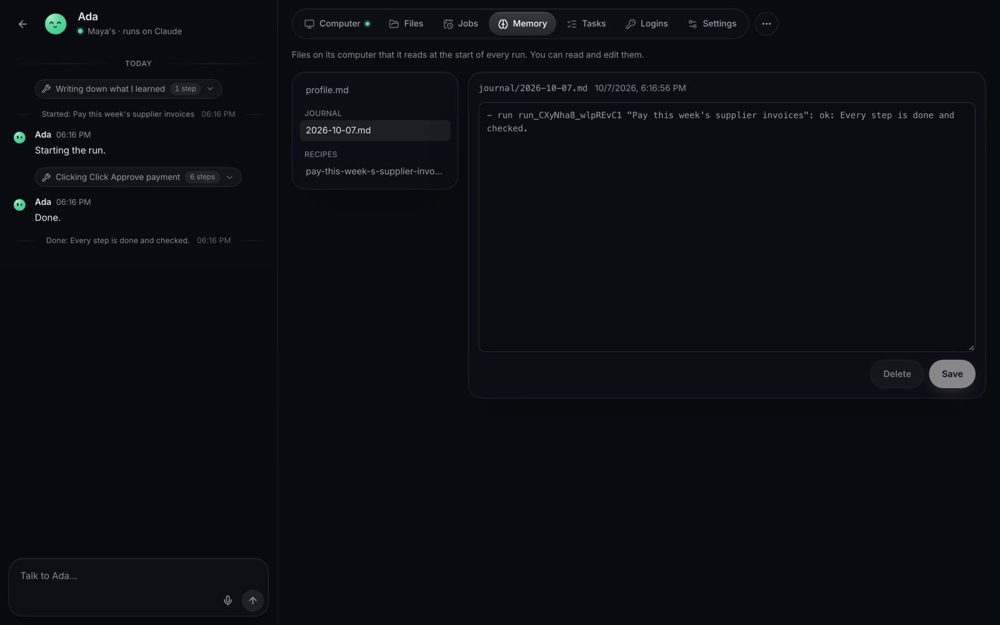
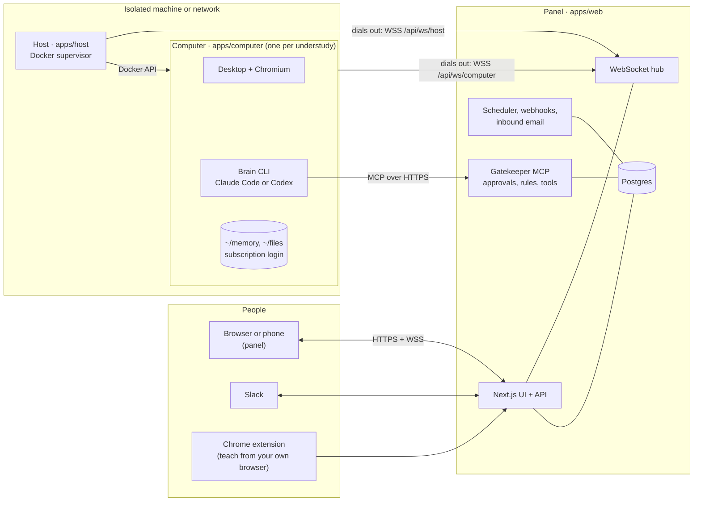

<h1 align="center">Understudy</h1>

<p align="center"><b>AI coworkers with computers of their own, that learn a task by watching you do it once.</b></p>

<p align="center">
  <a href="LICENSE"></a>
  
  
</p>

<p align="center">
  <a href="docs/media/demo.mp4"></a>
  <br><sub>Teach once, run on schedule, approve the irreversible step. <a href="docs/media/demo.mp4">Watch the full demo (MP4)</a>.</sub>
</p>

Understudy gives a team, technical or not, AI coworkers that each live on a full computer of their own: a desktop, Chrome, a terminal and office tools, running 24/7 in a container. You show an understudy a task in its browser and explain as you go; it writes the task down as a recipe it can repeat on a schedule, when an email or webhook arrives, or when you ask in the panel or on Slack. Before anything irreversible (sending, paying, publishing, deleting) it stops and asks you.

Each understudy runs on the AI subscription its owner already has (Claude or ChatGPT), logged in on its own computer. The login never leaves that computer.

## A look around

| | |
|---|---|
|  |  |
| **Its own computer.** Watch the whole desktop live, chat beside it, take control and hand it back. | **Teach by doing.** Drive its browser and explain why; every click, field and note is recorded. |
|  |  |
| **A recipe you can read.** The recording becomes plain steps you can edit, with the risky ones marked to ask first. | **It asks before it acts.** Irreversible steps wait for the owner, in the panel or on Slack. |
|  |  |
| **Every run on record.** Steps, screenshots, approvals, anomalies and cost. | **Memory you can see.** Profile, notes, journal and recipes are files on its computer, editable by the owner. |

Everything above runs locally with the scripted brain and fictional data (Northwind, Maya, Ada); see [Recording the demo](#recording-the-demo).

## What it does

- **One computer per understudy.** A Linux desktop with a home screen that shows the agent, Chromium, a terminal, LibreOffice, Python with pandas and DuckDB, OCR, pandoc, ffmpeg, image tools and HyperFrames for video. Blender, GIMP and Inkscape install on demand. It works from the terminal first and opens apps on screen to show results. It installs what else it needs.
- **Learns by watching.** Record a task in the understudy's browser, or from your own Chrome with the extension, narrating by voice or text. Or just describe it.
- **Runs on its own.** Schedules, per-task webhooks and email addresses, and watching a page for changes.
- **Asks before the irreversible.** The computer inspects the real element before every click and pauses pay, send, submit and delete-like actions for the owner. Owners add their own rules: maximum amounts, allowed email domains, blocked sites.
- **Talks where you are.** Chat in the panel, DMs and mentions on Slack, approvals from Slack, a daily briefing, push notifications on the phone.
- **Works with others.** Understudies message each other and hand tasks over; owners talk to several at once in rooms.
- **Uses your tools.** Admins register remote MCP servers; owners choose which actions ask first. A per-understudy vault fills passwords on the right site without the secret reaching the model.
- **Yours to run.** Apache 2.0, self-hosted with Docker Compose, English and Brazilian Portuguese panel.

[docs/FEATURES.md](docs/FEATURES.md) compares it with other persistent-agent products.

## Quick start

You need Docker with Compose and about 6 GB of free disk. The computer image is large (about 2 GB) and takes a while to build the first time.

```sh
git clone https://github.com/<owner>/understudy.git
cd understudy
cp example.env .env
sed -i.bak "s/^BETTER_AUTH_SECRET=.*/BETTER_AUTH_SECRET=$(openssl rand -hex 32)/; s/^UNDERSTUDY_HOST_TOKEN=.*/UNDERSTUDY_HOST_TOKEN=$(openssl rand -hex 32)/" .env
docker compose --profile build build
docker compose up -d
```

Open http://localhost:3000. On an empty database the panel asks you to create the first admin account. Then create an understudy, connect its brain with your Claude or ChatGPT subscription, and teach it a task.

**No AI account yet?** Set `UNDERSTUDY_FAKE_BRAIN=1` and `UNDERSTUDY_COMPUTER_ENV=UNDERSTUDY_FAKE_BRAIN` in `.env` and run `docker compose up -d` again. Understudies then use a scripted brain that is enough to try teaching, approvals and runs.

**One API key for everyone?** Set `ANTHROPIC_API_KEY` and `UNDERSTUDY_COMPUTER_ENV=ANTHROPIC_API_KEY` instead of logging in per understudy.

More accounts: set `UNDERSTUDY_ALLOWED_EMAIL_DOMAIN` to let people from your company sign up and wait for an admin's approval, or create them from the command line (it prints a temporary password):

```sh
docker compose exec web node dist/create-user.mjs --email someone@example.com --name "Their Name"
```

Every setting, from Google sign-in and Slack to inbound email and voice transcription, is in [docs/CONFIGURATION.md](docs/CONFIGURATION.md).

## How it works



- **Panel** (`apps/web`): where people create understudies, watch them live, teach and approve. It is also the API, the WebSocket hub, the gatekeeper MCP server every brain must call before an irreversible step, and the scheduler.
- **Host** (`apps/host`): a small supervisor on a machine with Docker. It keeps one computer container per understudy, with limits and no privileges.
- **Computer** (`apps/computer`): the understudy itself. A desktop with Chromium streamed to the panel, a recorder for teaching, and the coding-agent CLI that acts as its brain, driving the browser through Playwright over CDP.

Nothing connects into the machine that runs the computers: the host and every computer dial out to the panel. Message formats, the lifecycle and how memory stays small are in [docs/ARCHITECTURE.md](docs/ARCHITECTURE.md).

## Running the host and the computers elsewhere

`docker compose up` runs the panel, the host and the computers on one machine. For a team, keep the panel where people reach it and move the computers to a machine of their own:

1. Run the panel (the `web` and `postgres` services, or `apps/web` on Kubernetes) behind HTTPS, with WebSocket connections allowed to stay open for at least an hour. Set `UNDERSTUDY_PUBLIC_URL` and `UNDERSTUDY_HOST_IDS`.
2. On a dedicated machine with Docker and no route to your internal network, build or pull the computer image and start only the host:

   ```sh
   docker build -f apps/computer/Dockerfile -t understudy-computer:local .
   docker build -f apps/host/Dockerfile -t understudy-host:local .
   docker run -d --restart unless-stopped --name understudy-host \
     -v /var/run/docker.sock:/var/run/docker.sock \
     -e UNDERSTUDY_SERVER_URL=https://understudy.example.com \
     -e UNDERSTUDY_HOST_TOKEN=<same value as the panel> \
     -e UNDERSTUDY_HOST_ID=host-1 \
     -e UNDERSTUDY_COMPUTER_IMAGE=understudy-computer:local \
     understudy-host:local
   ```

3. The host appears in the panel; every understudy created from then on gets its computer there. Add more hosts with other ids to grow.

You can also run one computer by hand, with no panel at all, against the mock panel in `apps/computer` (see [CONTRIBUTING.md](CONTRIBUTING.md#run-a-computer-without-the-panel)). [`apps/host/README.md`](apps/host/README.md) lists every host variable, and [`infra/`](infra/README.md) is a complete AWS deployment (an isolated VPC for the hosts, Postgres on RDS, the panel on Kubernetes) you can adapt.

## Security FAQ

An understudy has a whole machine, a browser logged into real sites and an AI that decides what to type. These are the questions to ask before you run it, and the honest answers.

**What stops it from doing something I did not want?**
The brain never gets a shortcut around the owner. Before every click or Enter the computer looks at the real element on the page; anything that would commit (submit, pay, send, delete, publish) and every step marked "ask" pauses until the owner answers, in the panel or on Slack. First runs, webhook runs and email-started runs always ask. Owner rules (maximum amount, allowed email domains, blocked sites, rules in plain words) are enforced by the computer and the gatekeeper, not by asking the model nicely. Approvals wait up to 24 hours, then the run stops.

**What about prompt injection from a web page or an email?**
Content from pages, emails and teammates is passed to the brain as quoted, untrusted data, and none of it can approve anything: only the owner's answer does. That limits the damage of an injected instruction to what the understudy may do without asking, which is why commit-like actions ask by default. It does not make injection impossible; keep "ask first" on for anything that matters.

**Can an understudy reach my other machines, or another understudy?**
Each computer is its own container: never privileged, all Linux capabilities dropped, `no-new-privileges`, its own volume, memory and process limits, on a Docker network with traffic between containers turned off, and never on the host network. Nothing listens for inbound connections. Egress, however, is whatever the machine running the host allows. On a laptop with `docker compose`, a computer can reach your local network. For a team, run the host on a dedicated machine or network with internet-only egress, as the AWS setup in `infra/` does. Connected MCP tools may never live on private, loopback, link-local, metadata or CGNAT addresses.

**Where do my Claude or ChatGPT login and my passwords live?**
The subscription login is made by the official CLI inside the understudy's computer and stays on its volume; the panel never sees it. Password fields are masked in recordings. Site passwords you store go into a vault on the understudy's own computer (AES-256-GCM, key on its volume) and are typed into the matching field on the matching site without the secret entering the model's context (with the Claude brain). This keeps secrets out of prompts and transcripts; it is not a barrier against code running on that same computer, so give an understudy only the logins it needs. Tool credentials an admin adds are encrypted at rest in Postgres with `UNDERSTUDY_SECRET_KEY`.

**Who can see what?**
Owners see their own understudies. Teammates an owner adds can be approvers or viewers. Admins manage accounts, hosts and connected tools, and read every understudy as a viewer: they see its chat, runs, screen and the files posted in the chat, but cannot answer its approvals, talk to it or drive its computer. The host must present `UNDERSTUDY_HOST_TOKEN`, a new host id has to be approved by an admin unless listed in `UNDERSTUDY_HOST_IDS`, and each computer has its own token, of which the panel stores only a hash.

**What does the host itself need?**
Access to the Docker socket, which is root on that machine. That is why the host belongs on a machine that runs nothing but Understudy. The host only starts the one computer image it was configured with.

**Is it audited?**
Every tool call through the gatekeeper is logged, and every run keeps its steps, screenshots, approvals and cost. The software has not had an external security audit. Report problems privately as described in [SECURITY.md](SECURITY.md).

**Am I allowed to run my subscription this way?**
Each person logs in with their own account, on a computer only their understudies use. Whether that fits your plan is between you and your provider; with an API key or gateway (`ANTHROPIC_API_KEY`, `OPENAI_API_KEY`) you pay per use instead.

## Recording the demo

The video and screenshots above are produced by Playwright against a local stack with the scripted brain and a fictional invoice site, so they can be regenerated after any UI change:

```sh
tests/e2e/demo/record.sh
DEMO_SPEC=screenshots.spec.ts tests/e2e/demo/record.sh
```

## Development

[CONTRIBUTING.md](CONTRIBUTING.md) explains the layout, how to run each piece and what a pull request needs. Security reports go through [SECURITY.md](SECURITY.md).

## License

[Apache License 2.0](LICENSE).
